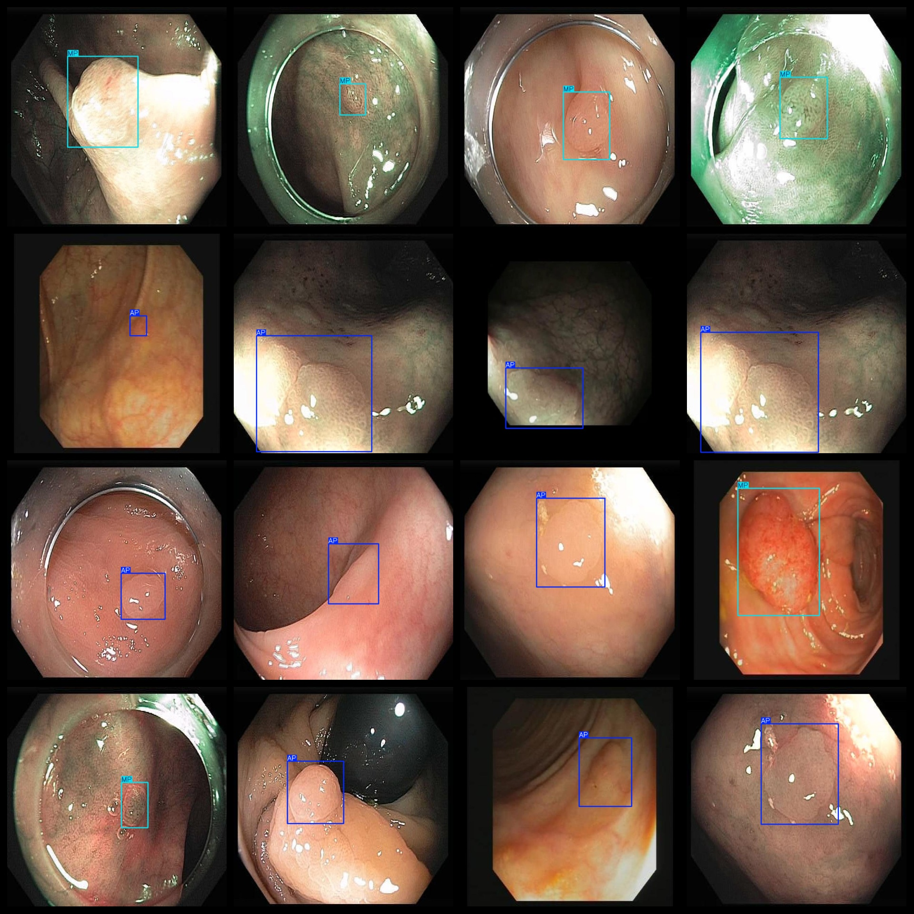
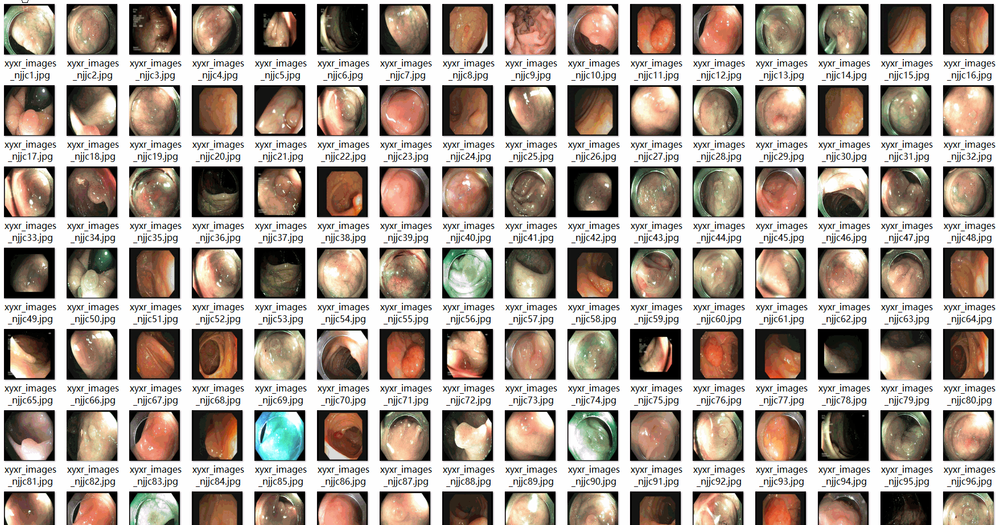

# 2 typesInside Microscopic polyps Dataset 9248 imagesVOC+YOLO

2 endoscopic polyp datasets 9248 VOCs + YOLOs

Dataset format: Pascal VOC format + YOLO format (the txt file does not contain the split path, it only contains jpg images and corresponding VOC format xml files and yolo format txt files)

Number of images (number of jpg files): 9248

Number of XML Files: 9248

Number of annotations (number of txt files): 9248

Label count: 2

The Github repository is: datasets_sl

Annotation class names: ["AP","MP"]

Number of boxes labeled in each category:

The number of APs is 4367.

MP Frames = 4881

Total Frames: 9248

Number of images per category:

AP occupancy = 4367 (adenomatous polyps)

MP occupying the number of images = 4881 (proliferative polyps)

Image resolution: 640x640

Use the labeling tool: labelImg

Dataset Augmentation: Yes

Rules for annotation: Draw a rectangle around the category.

Important note: The dataset does not have been divided into training, validation, and testing sets.

Special Disclaimer: This dataset does not guarantee the accuracy of the trained models or weight files.

Annotation and image details are as follows:

## Images

---

Here is a pay link on Stripe (https://buy.stripe.com/3cs8yP7sY87d0vu9AB). Please contact me lonlonago@foxmail.com after funding $89, and I will send you a complete data files, thank you!

